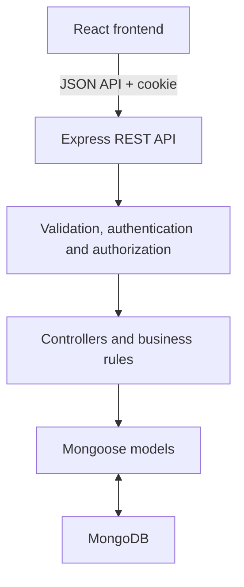

# Service Request Management System

A full-stack MERN application developed for the VisionRoot Software Engineering Internship assignment. Users can securely submit and manage service requests, while administrators can review all requests, update their status, and manage user accounts.

## Project overview and objectives

- Provide separate User and Admin login flows.
- Allow public registration for Users only.
- Let Users create, view, edit, and cancel their own requests.
- Let Admins search, filter, sort, and paginate all requests.
- Enforce valid request-status transitions on the server.
- Let Admins activate and deactivate User accounts.
- Apply validation, authentication, authorization, and basic API security.
- Keep the code readable and suitable for an interview assignment.

## Technology stack

| Layer | Technology | Reason |
| --- | --- | --- |
| Frontend | React + Vite | Reusable components, state-based UI, and fast development/build tooling. |
| Routing | React Router | Protected client-side User and Admin routes. |
| Backend | Node.js + Express | Clear REST API and middleware structure. |
| Database | MongoDB Atlas | Document storage that fits the MERN stack. |
| ODM | Mongoose | Schemas, references, timestamps, validation, and indexes. |
| Validation | Zod | Rejects invalid and unexpected API input early. |
| Authentication | JWT in HttpOnly cookie | The token is unavailable to frontend JavaScript. |
| Passwords | bcrypt | Stores one-way password hashes instead of plain text. |
| Security | Helmet, CORS, rate limiting | Security headers, origin control, and basic abuse protection. |
| Testing | Node test runner, Supertest, mongodb-memory-server | Isolated rule and HTTP API tests. |

## System architecture



React calls the API with `credentials: "include"`. Express validates input, verifies the JWT cookie, checks role and ownership, and then runs the controller. Mongoose reads or updates MongoDB. The frontend stores the JSON response in state and updates the UI.

## Project structure

```text
visionroot-software-engineering-assignment/
├── backend/
│   ├── scripts/seedAdmin.js
│   ├── src/
│   │   ├── config/
│   │   ├── controllers/
│   │   ├── middleware/
│   │   ├── models/
│   │   ├── routes/
│   │   ├── utils/
│   │   ├── validation/
│   │   ├── app.js
│   │   └── server.js
│   ├── tests/
│   ├── .env.example
│   └── package.json
├── frontend/
│   ├── src/
│   │   ├── api/
│   │   ├── components/
│   │   ├── context/
│   │   ├── pages/
│   │   ├── App.jsx
│   │   └── main.jsx
│   ├── .env.example
│   └── package.json
├── docs/
│   ├── API.md
│   ├── TESTING.md
│   └── VisionRoot.postman_collection.json
└── README.md
```

## Database and schema overview

Separate `users` and `admins` collections are used. Registration creates only Users. Admins are created locally using the seed script.

### User and Admin

| Field | Purpose |
| --- | --- |
| `name` | Display name. |
| `email` | Normalized and unique inside its collection. |
| `passwordHash` | bcrypt hash; never returned by the API. |
| `role` | Fixed as `USER` or `ADMIN`. |
| `isActive` | Controls protected API access. |
| `tokenVersion` | Invalidates old tokens after logout/status changes. |
| `createdAt`, `updatedAt` | Mongoose timestamps. |

### ServiceRequest

| Field | Values / purpose |
| --- | --- |
| `title` | Required, 3–120 characters. |
| `description` | Required, 10–3000 characters. |
| `category` | `Technical`, `Billing`, `Account`, or `Other`. |
| `priority` | `LOW`, `MEDIUM`, or `HIGH`. |
| `status` | `PENDING`, `IN_PROGRESS`, `RESOLVED`, or `CANCELLED`. |
| `createdBy` | Reference to the User who created it. |
| `createdAt`, `updatedAt` | Mongoose timestamps. |

One User can own many Service Requests. Admins manage requests but do not own them.

## Authentication and authorization

- Registration accepts only name, email, and password; clients cannot register as Admin.
- Login accepts `accountType: "USER"` or `"ADMIN"`, but the role is obtained from the verified database account.
- Passwords are hashed with bcrypt cost factor 12.
- JWTs expire after eight hours and use an `HttpOnly`, `SameSite=Lax` cookie. Production also enables `Secure`.
- Every protected request verifies the JWT and reloads the account.
- Role middleware separates User-only and Admin-only routes.
- Ownership checks prevent Users accessing another User's request.
- Logout and account-status changes invalidate earlier tokens.
- CORS restricts the browser origin. JSON write requests require `X-Requested-With: XMLHttpRequest`.
- Helmet, a 16 KB body limit, and IP rate limiting provide basic protection.

## API reference

Local base URL:

```text
http://localhost:5000/api
```

### Authentication

| Method | Endpoint | Access | Purpose |
| --- | --- | --- | --- |
| POST | `/auth/register` | Public | Register a User. |
| POST | `/auth/login` | Public | Log in as User/Admin. |
| GET | `/auth/me` | Authenticated | Get current account. |
| POST | `/auth/logout` | Authenticated | End the session. |

```json
{
  "email": "user@example.com",
  "password": "strong-password",
  "accountType": "USER"
}
```

### Service requests

| Method | Endpoint | Access | Purpose |
| --- | --- | --- | --- |
| GET | `/requests` | User/Admin | List own/all requests. |
| POST | `/requests` | User | Create a request. |
| GET | `/requests/:id` | User/Admin | View an accessible request. |
| PATCH | `/requests/:id` | User | Edit an owned pending request. |
| DELETE | `/requests/:id` | User | Cancel an eligible request. |
| PATCH | `/requests/:id/status` | Admin | Update request status. |

List query parameters: `page`, `limit`, `search`, `status`, `category`, `priority`, and `sort=newest|oldest`.

```json
{
  "title": "Unable to access my account",
  "description": "The login page shows an error after submitting the form.",
  "category": "Account",
  "priority": "HIGH"
}
```

Admin status update:

```json
{ "status": "IN_PROGRESS" }
```

### User management

| Method | Endpoint | Access | Purpose |
| --- | --- | --- | --- |
| GET | `/users` | Admin | Search/filter/paginate Users. |
| GET | `/users/:id` | Admin | View a User. |
| PATCH | `/users/:id/status` | Admin | Activate/deactivate a User. |

```json
{ "isActive": false }
```

`GET /health` is public and reports API/database health.

All POST/PATCH/DELETE calls send JSON and include:

```text
Content-Type: application/json
X-Requested-With: XMLHttpRequest
```

Browser requests also use `credentials: "include"`. More examples are in `docs/API.md` and the Postman collection.

## Environment variables

### `backend/.env.example`

```dotenv
PORT=5000
MONGODB_URI=
NODE_ENV=development
CLIENT_ORIGIN=http://localhost:5173
JWT_SECRET=
ADMIN_NAME=
ADMIN_EMAIL=
ADMIN_PASSWORD=
```

### `frontend/.env.example`

```dotenv
VITE_API_URL=http://localhost:5000/api
```

Copy each example to a file named `.env` in the same folder. Never commit completed environment files or credentials.

Generate a JWT secret:

```bash
node -e "console.log(require('node:crypto').randomBytes(48).toString('hex'))"
```

## Installation and setup

Requirements: Node.js 24.x, npm, Git, and MongoDB Atlas or local MongoDB.

```bash
git clone https://github.com/nadeera365/visionroot-software-engineering-assignment.git
cd visionroot-software-engineering-assignment
```

Backend:

```bash
cd backend
npm install
# Create and complete backend/.env first
npm run seed:admin
```

Repeated seeding does not reset an existing Admin password.

Frontend:

```bash
cd ../frontend
npm install
# Create frontend/.env from frontend/.env.example
```

## Running frontend and backend

Use two terminals from the project root.

Terminal 1:

```bash
cd backend
npm run dev
```

Backend: `http://localhost:5000`

Terminal 2:

```bash
cd frontend
npm run dev
```

Frontend: `http://localhost:5173`

Register through the User option. Admin login uses the credentials configured locally before running the seed command. Admin credentials are intentionally not included in this README.

## Running tests

Backend integration tests:

```bash
cd backend
npm test
```

The first run may download a MongoDB binary of several hundred megabytes for `mongodb-memory-server`. It does not use or change Atlas data.

Unit-only business-rule tests:

```bash
npm run test:unit
```

Frontend production build check:

```bash
cd frontend
npm run build
```

Manual API tests can use `docs/VisionRoot.postman_collection.json`.

## Assumptions and business rules

| Current status | Allowed next status |
| --- | --- |
| `PENDING` | `IN_PROGRESS`, `CANCELLED` |
| `IN_PROGRESS` | `RESOLVED`, `CANCELLED` |
| `RESOLVED` | None |
| `CANCELLED` | None |

- New requests start as `PENDING`.
- Users edit only their own `PENDING` requests.
- Users cancel their own `PENDING` or `IN_PROGRESS` requests.
- Cancellation preserves the document and sets `CANCELLED`.
- Only Admins move requests to `IN_PROGRESS` or `RESOLVED`.
- `RESOLVED` and `CANCELLED` are terminal.
- Concurrent updates verify the previous status.
- Public registration always creates a User.
- Email is unique within each account collection; the same email may exist once in each separate collection.
- Request search uses MongoDB text search over title/description.
- Pagination defaults to 10 and permits at most 100 records.

## Known limitations

- No password reset or email verification.
- Logout invalidates all sessions for that account.
- One frontend origin is configured at a time.
- Rate-limit state is stored in one server process.
- Search is keyword-based rather than fuzzy/partial.
- Offset pagination is intended for assignment-scale data.
- No attachments, comments, notifications, or status-history timeline.
- No automated browser end-to-end tests.
- No independent security audit or load test.

## Potential future improvements

- Email verification and secure password reset.
- Request comments and Admin responses.
- Status-history/audit log and notifications.
- Validated file attachments.
- Dashboard charts and date filters.
- Redis-backed distributed rate limiting.
- Cursor pagination and advanced search.
- Frontend/browser test automation.
- Docker, CI/CD, centralized logs, monitoring, and production deployment.

## Security note

Never add real MongoDB credentials, JWT secrets, Admin passwords, completed `.env` files, or `node_modules` to GitHub, documentation, screenshots, or shared ZIP files. Review `git status` before every commit.
