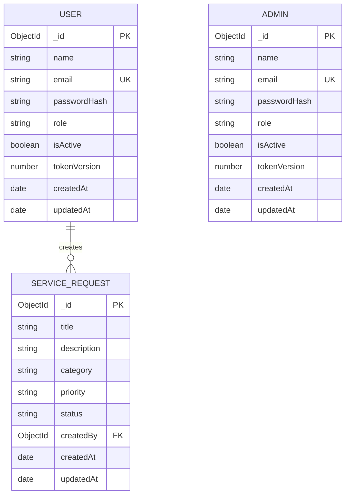

# Database and Schema Documentation

## Overview

The Service Request Management System uses MongoDB with Mongoose. MongoDB is suitable for this project because User, Admin, and Service Request records map naturally to documents, while Mongoose provides schemas, validation, references, timestamps, and indexes.

The application uses three collections:

- `users` for registered User accounts.
- `admins` for seeded Admin accounts.
- `service_requests` for requests submitted by Users.

User and Admin accounts are intentionally stored separately. Public registration writes only to `users`. Admin records are created through the local seed script.

## Relationship diagram



One User may create many Service Requests. Each Service Request belongs to exactly one User through `createdBy`. Admins do not own requests; authorization allows them to view and manage all requests.

## Users collection

Collection name: `users`

| Field | Type | Required | Rules |
| --- | --- | --- | --- |
| `_id` | ObjectId | Yes | Generated by MongoDB. |
| `name` | String | Yes | Trimmed; 2–80 characters. |
| `email` | String | Yes | Trimmed, lowercase, valid format, maximum 254 characters, unique in `users`. |
| `passwordHash` | String | Yes | bcrypt hash; excluded from normal queries and API output. |
| `role` | String | Yes | Fixed and immutable as `USER`. |
| `isActive` | Boolean | Yes | Defaults to `true`. |
| `tokenVersion` | Number | Yes | Non-negative safe integer; defaults to `0`; excluded from normal output. |
| `createdAt` | Date | Yes | Automatically generated by Mongoose. |
| `updatedAt` | Date | Yes | Automatically updated by Mongoose. |

## Admins collection

Collection name: `admins`

| Field | Type | Required | Rules |
| --- | --- | --- | --- |
| `_id` | ObjectId | Yes | Generated by MongoDB. |
| `name` | String | Yes | Trimmed; 2–80 characters. |
| `email` | String | Yes | Trimmed, lowercase, valid format, maximum 254 characters, unique in `admins`. |
| `passwordHash` | String | Yes | bcrypt hash; excluded from normal queries and API output. |
| `role` | String | Yes | Fixed and immutable as `ADMIN`. |
| `isActive` | Boolean | Yes | Defaults to `true`. |
| `tokenVersion` | Number | Yes | Non-negative safe integer; defaults to `0`; excluded from normal output. |
| `createdAt` | Date | Yes | Automatically generated by Mongoose. |
| `updatedAt` | Date | Yes | Automatically updated by Mongoose. |

Admins are created using:

```bash
cd backend
npm run seed:admin
```

The script reads `ADMIN_NAME`, `ADMIN_EMAIL`, and `ADMIN_PASSWORD` from the local backend environment file. Admin credentials are never stored in this documentation.

## Service requests collection

Collection name: `service_requests`

| Field | Type | Required | Rules |
| --- | --- | --- | --- |
| `_id` | ObjectId | Yes | Generated by MongoDB. |
| `title` | String | Yes | Trimmed; 3–120 characters. |
| `description` | String | Yes | Trimmed; 10–3000 characters. |
| `category` | String | Yes | `Technical`, `Billing`, `Account`, or `Other`. |
| `priority` | String | Yes | `LOW`, `MEDIUM`, or `HIGH`; defaults to `MEDIUM`. |
| `status` | String | Yes | `PENDING`, `IN_PROGRESS`, `RESOLVED`, or `CANCELLED`; defaults to `PENDING`. |
| `createdBy` | ObjectId | Yes | Immutable reference to a document in `users`. |
| `createdAt` | Date | Yes | Automatically generated by Mongoose. |
| `updatedAt` | Date | Yes | Automatically updated by Mongoose. |

Example document:

```json
{
  "_id": "68d3f35f3a53aa09e1234567",
  "title": "Payment receipt missing",
  "description": "Payment succeeded but I have not received the receipt.",
  "category": "Billing",
  "priority": "HIGH",
  "status": "PENDING",
  "createdBy": "68d3f2da3a53aa09e1234560",
  "createdAt": "2026-09-24T10:00:00.000Z",
  "updatedAt": "2026-09-24T10:00:00.000Z"
}
```

## Indexes

| Collection | Index | Purpose |
| --- | --- | --- |
| `users` | Unique `email` | Prevent duplicate User accounts. |
| `users` | `createdAt: -1, _id: -1` | Efficient Admin User listing and stable newest-first sorting. |
| `admins` | Unique `email` | Prevent duplicate Admin accounts. |
| `service_requests` | `createdBy: 1, createdAt: -1, _id: -1` | Efficiently list one User's requests. |
| `service_requests` | `createdAt: -1, _id: -1` | Efficient Admin listing by creation date. |
| `service_requests` | `status: 1, createdAt: -1, _id: -1` | Support status filtering and date sorting. |
| `service_requests` | Text index on `title` and `description` | Support required keyword search. |

The `_id` field is included in sorting indexes as a deterministic tie-breaker when documents have equal timestamps.

## Data integrity and security rules

- The backend sets `createdBy` from the authenticated User; it is never trusted from the request body.
- `createdBy` and account roles are immutable.
- Public registration always creates a `USER`.
- Passwords are hashed before storage and are never returned through the API.
- API validation runs before Mongoose validation and rejects unexpected properties.
- A normal User query includes the authenticated User ID, preventing access to another User's requests.
- Admin authorization is checked before Admin-only database operations.
- Request status changes are validated in backend business logic.
- Status updates include the previous status in the update filter to protect against conflicting concurrent changes.
- Cancellation preserves the request document and changes its status to `CANCELLED`.
- `RESOLVED` and `CANCELLED` are terminal states.
- Deactivation and logout increment `tokenVersion`, invalidating earlier JWT sessions.

## Status workflow

| Current status | Allowed next status |
| --- | --- |
| `PENDING` | `IN_PROGRESS`, `CANCELLED` |
| `IN_PROGRESS` | `RESOLVED`, `CANCELLED` |
| `RESOLVED` | None |
| `CANCELLED` | None |

## Design assumptions

- Email uniqueness is enforced independently in `users` and `admins`. The same email may therefore exist once in each collection; the login account-type selector identifies which collection to authenticate against.
- MongoDB text search is keyword based rather than partial or fuzzy matching.
- Offset pagination is appropriate for the expected assignment-scale dataset.
- User records are deactivated instead of deleted so their Service Request references remain valid.
- MongoDB access should remain restricted because direct external database changes can bypass application-level business rules.

## Relevant model files

- `backend/src/models/User.js`
- `backend/src/models/Admin.js`
- `backend/src/models/ServiceRequest.js`
